<h1 align="left">Hi, I'm Hans</h1>

  <strong>Senior Software Engineer</strong> 
  I build accessible, performant web experiences — from polished interfaces to scalable backends.

  <a href="https://www.linkedin.com/in/hansgarcia/">LinkedIn</a> ·
  <a href="https://hansgarcia.dev">Portfolio</a> ·
  <a href="https://github.com/hlebon">GitHub</a>

---

### About

Software engineer focused on pixel-perfect, accessible interfaces and reliable systems. Currently at **Electric Power Engineers**, building map-based applications and infrastructure tooling.

I work across the stack — UI design and implementation, API design, and cloud infrastructure.

---

### Stack

  
  
  
  
  
  
  
  
  
  
  
  

---

### Background

| Industry | Focus |
| --- | --- |
| Energy & Infrastructure | Map-based web applications |
| E-commerce & Retail | Analytics and conversion optimization |
| Healthcare Tech | Workflow management systems |
| Software Development | Legacy modernization |

---

### GitHub

  
  

  
  

